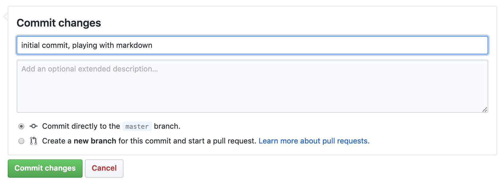
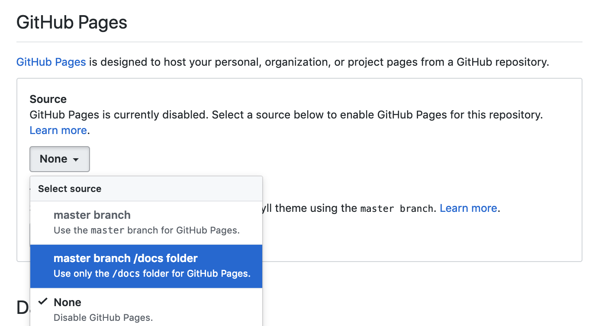
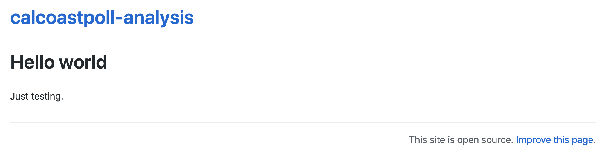

# Collaborate: git, Github

## Overview {.objectives}

**Objectives**

1. **Create a repository** in Github
1. Learn basic **markdown** to format text in `README.md`.
1. Commit changes.
1. Create `docs/index.md` as a temporary website.
1. Create an Rmarkdown document at `docs/index.Rmd` as new website.

## What are git and Github?

The two main tools you'll learn about to start are:

- [**Git**](https://git-scm.com/) is a version control system that lets you track changes to files over time. These files can be any kind of file (eg doc, pdf, xls), but free text differences are most easily visible (eg txt, csv, md). You can rollback changes made by you, or others. This facilitates a playground for collaboration, without fear of experimentation (you can always rollback changes).

- [**Github**](https://github.com/) is a website for storing your git versioned files remotely. It has many nice features to be able visualize differences between [images](https://help.github.com/articles/rendering-and-diffing-images/), [geojson spatial](https://help.github.com/articles/mapping-geojson-files-on-github/) files with [geojson differencing](https://github.com/blog/1772-diffable-more-customizable-maps), [csv tables](https://help.github.com/articles/rendering-csv-and-tsv-data/), and [track changes in text](https://help.github.com/articles/rendering-differences-in-prose-documents/).

## Create repository in Github

Now you will create a Github repository for this project.

1. [Create a repository](https://help.github.com/articles/create-a-repo/) called `calcoastpoll-analysis`.

    `r img(src='figs/github_repo-create.png', width=200)`
    
    Please be sure to tick the box to **Initialize this repository with a README**. Otherwise defaults are fine.
    
    `r img(src='figs/github_create-repo.png', width=600)`

### Edit `README.md` as markdown and commit changes

[Commit your first change](https://help.github.com/articles/create-a-repo/#commit-your-first-change) by editing the `README.md` which is in **markdown**, simple syntax for formatting web content (ie HTML). Now update the contents of the `README.md` with the following, having a link and a numbered list:
  
```md
# calcoastpoll-analysis
California Coastal Poll analysis at [CSUCI ESRM](https://esrm.zone)

## Introduction

This repository demonstrates **software** and _formats_:

1. **Git**
1. **Github**
1. _Markdown_
1. _Rmarkdown_

## Conclusion


```
    
Now click on the <span class="octicon octicon-eye"></span> Preview changes to see the markdown rendered as HTML:
    
`r img(src='figs/github_preview_README-md.png', width=500)`
    
Notice the syntax for:

- **numbered list** gets automatically sequenced: `1.`, `1.`
- **headers** get rendered at multiple levels: `#`, `##`
- **link**: `[](http://...)`
- **image**: ``
- _italics_: `_word_` 
- **bold**: `**word**`

See [Mastering Markdown · GitHub Guides](https://guides.github.com/features/mastering-markdown/) and add some more personalized content to the README of your own, like a bulleted list or blockquote.

Commit changes with a message.



Check out the Raw, Blame and History buttons in the upper right.

## Create `docs/index.md` and turn on Github Pages

Now we'll create a placeholder for a website. Go to your main repository site by clicking on the USER/calcoastpoll-analysis link at top left, and then click on the "Create new file" button and enter `docs/index.md`. Paste in something simple (we'll delete this later) like:

```md
# Hello world

Just testing.
```

Now we'll turn on the hosting of a website for this repository using the `docs` folder with the [Github Pages](https://pages.github.com) feature.

Go to the **Settings** top tab (and default Options left tab), scroll down to **Github Pages** and update the **Source** to using the `/docs` folder:



Now you should be able to visit your Github Pages at:


`https://USER.github.io/calcoastpoll-analysis`


Be sure to replace `USER` with your username. It should something like this:



The extra repository header "calcoastpoll-analysis" and footer "This site is open source. Improve this page." come from Github's default use of a static website templating system called [Jekyll](https://jekyllrb.com), which we're not going to use. 

Instead, we'll next get this repository onto our own machine, weave in chunks of interpreted R code with basic formatted markdown and generate our own data-driven web page to replace this `index.md`.

## Setup git

To get the repository onto your local machine you'll need to configure the previously installed git on your machine.

Open up the Git Bash on Windows, or Terminal on Mac and type the following on the command line, replacing:

```bash
# display your version of git
git --version

# name: replace USER with your Github user account
git config –-global user.name USER

# email: replace USER@csuci.edu with the email you used to register with Github
git config –-global user.email USER@csuci.edu

# list your config to confirm user.* variables set
git config --list
```

## Github Workflows

The two most common workflow models for working Github repositories is based on your permissions:

1. **writable**: Push & Pull (simplest)

1. **read only**: Fork & Pull Request (extra steps)

We will only go over the first writable mode. For more on the second mode, see [Forking Projects · GitHub Guides](https://guides.github.com/activities/forking/).

**Push & Pull:**

repo location | initialize <i class="fa fa-arrow-down"></i> | edit <i class="fa fa-arrow-up"></i> | update <i class="fa fa-arrow-down"></i>
-----------|:-----------:|:-----------:|:-----------:|:-----------:
<i class="fa fa-cloud"></i> `github.com/OWNER/REPO` |  [**create**](https://help.github.com/articles/create-a-repo/) <span class="octicon octicon-plus"></span> |   |
<i class="fa fa-desktop"></i> `~/github/REPO`      |  [**clone**](https://help.github.com/articles/fetching-a-remote) <span class="octicon octicon-desktop-download"></span> | [**commit**](http://git-scm.com/docs/git-commit) <span class="octicon octicon-git-commit"></span>,  [**push**](https://help.github.com/articles/pushing-to-a-remote/) <span class="octicon octicon-cloud-upload"></span> | [**pull**](https://help.github.com/articles/fetching-a-remote/#pull) <span class="octicon octicon-cloud-download"></span>

Note that OWNER could be either an individual USER or group ORGANIZATION, which has member USERs.

## Create RStudio Project with Github repo

Next, you will [clone the repository](https://help.github.com/articles/fetching-a-remote) onto your local machine using RStudio. I recommend creating it in a folder `github` under your user or Documents folder.

Open RStudio and under the menu File -> New Project... -> Version Control -> git and enter the URL with the `.git` extension (also available from the repository's green Clone button):

`r img(src='figs/rstudio_clone.png', width=300)`

If it all works correctly then you should see the files downloaded and showing up in the Files pane of RStudio. If RStudio is configured correctly to work with git, then you should also see a Git pane.

## Create `docs/index.Rmd` in Rmarkdown

Rmarkdown allows you to weave markdown text with chunks of R code to be evaluated to output content like tables and plots.

File -> New File -> Rmarkdown... -> Document of output format HTML, OK.

`r img(src='figs/rstudio_new-rmd.png', width=300)`

You can give it a Title of "Analysis". After you click OK, most importantly File -> Save as `index` (which will get named with the filename extension `index.Rmd`).

Some initial text is already provided for you. Let's go ahead and click on the "Knit" button at the top of the code pane.

Notice how the markdown is rendered similar to as before + **R code chunks** are surrounded by 3 backticks and `{r LABEL}`. These are evaluated and return the output text in the case of `summary(cars)` and the output plot in the case of `plot(pressure)`.

Notice how the code `plot(pressure)` is not shown in the HTML output because of the R code chunk option `echo=FALSE`.

Before we continue exploring Rmarkdown, visit the Git pane, check all modified (M) or untracked (?) files, click Commit, enter a message like "added index.Rmd" and click the "Commit" button. Then Push (up green arrow) to push the locally committed changes on your machine up to the Github repository online.

This will update <https://github.com/USER/calcoastpoll-analysis>, and now you can also see your project website with a default `index.html` viewable at <http://USER.github.io/calcoastpoll-analysis>

For more on Rmarkdown:

- [rmarkdown cheatsheet.pdf](https://github.com/rstudio/cheatsheets/raw/master/rmarkdown-2.0.pdf)
- [rmarkdown.rstudio.com](http://rmarkdown.rstudio.com)

